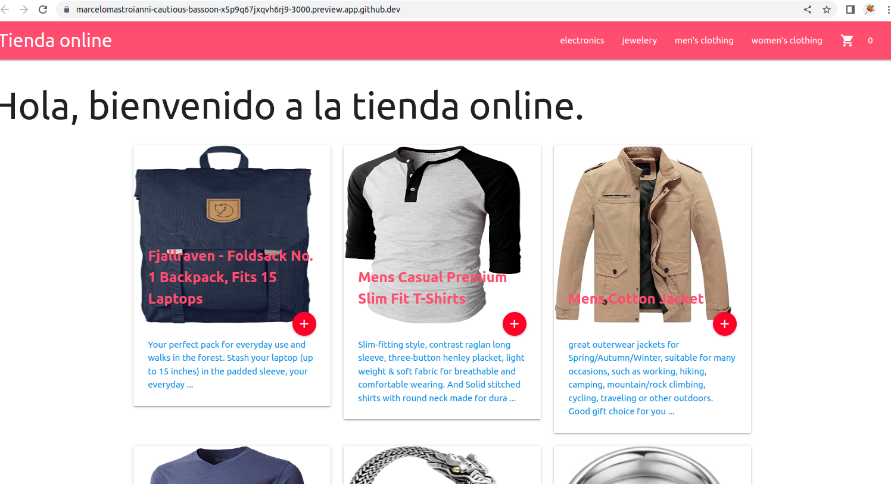
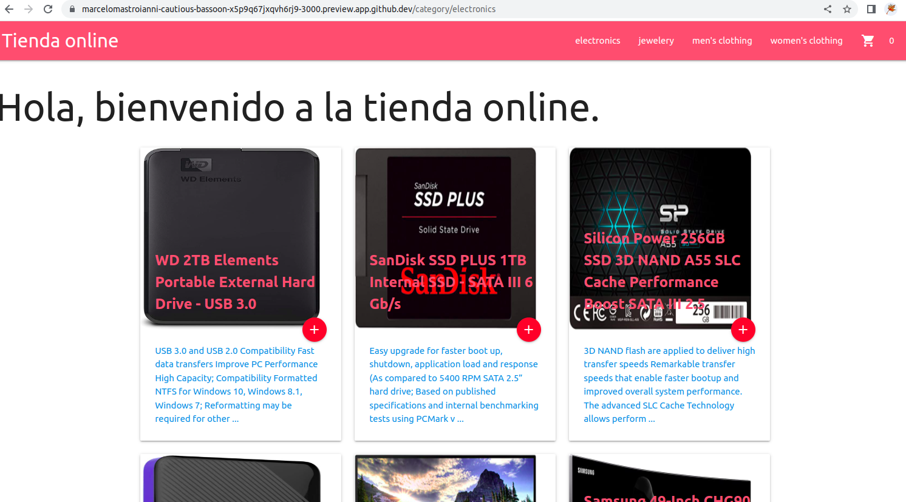
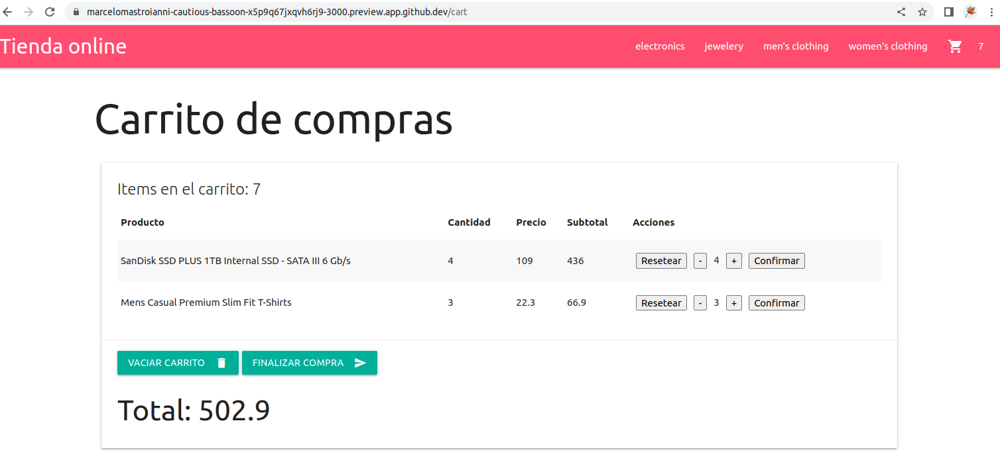
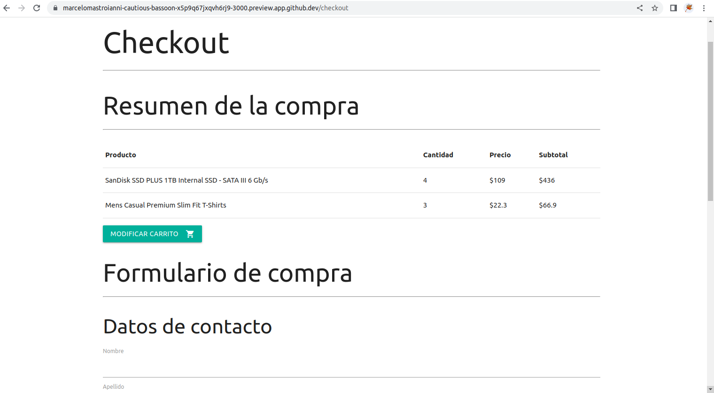
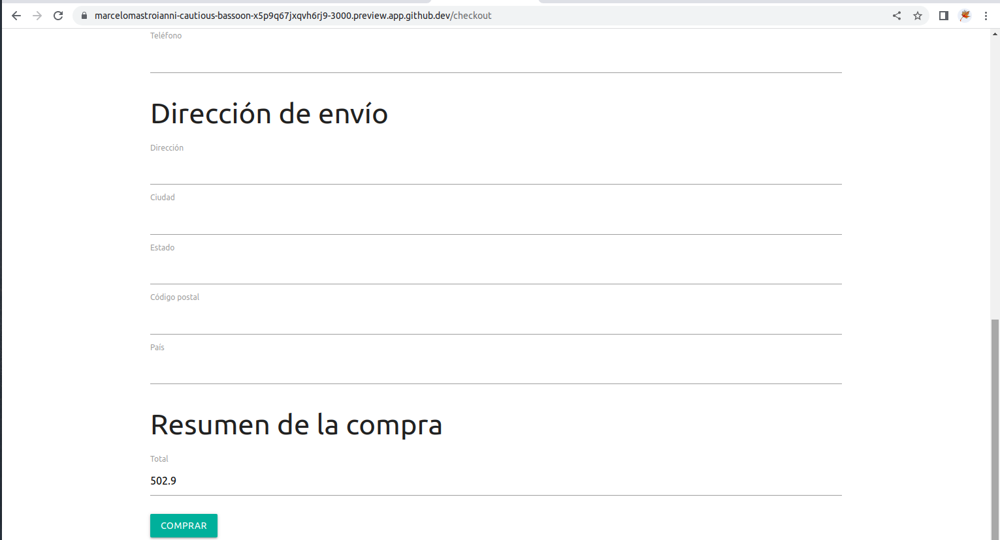
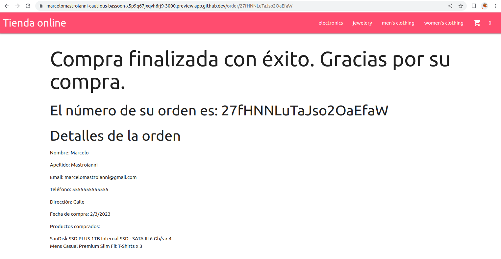

# Descripcion del proyecto

Este proyecto corresponde a la entrega final del curso de programacion React de CoderHouse.

https://www.coderhouse.com/online/reactjs

El proyecto consiste en una pagina de ecommerce que utiliza por un lado la api publica de https://fakestoreapi.com/ para realizar la consulta de las categorias y de los productos y por otro lado utiliza Firebase para guardar las compras realizadas en el sitio.

# Uso e instalación

* Clonar el repositorio:

`git clone https://github.com/marcelomastroianni/curso-programacion-reactjs-coderhouse.git`

* Posicionarse en la carpeta de la entrega final:

`cd EntregaFinalMastroianni`

* Instalar dependecias:

`npm install`

* Correr el proyecto en modo desarrollo:

`npm start`

# Tecnologías usadas

* ReactJS
* Firebase
* Materialize CSS (https://materializecss.com/)
* Paquete react-toastify de npm para realizar las alertas

# Pantallas Funcionalidad

## Pantalla de inicio:

## Categoria Electronicos

## Detalle de un producto

## Agrego productos al carrito

## Vista del carrito

## Formulario del checkout

## Comprobante compra realizada

